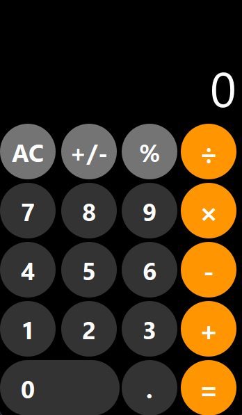

# iOS сalculator

Калькулятор с повторением дизайна iOS, написанный на Python с использованием PySide6.

## ✨ Особенности

- **Точный iOS-дизайн** - полное визуальное соответствие калькулятору iPhone
- **Плавные анимации** - эффекты при наведении и нажатии кнопок
- **Безопасные вычисления** - собственная логика без использования `eval()`
- **Полная функциональность** - все базовые операции и специальные функции
- **Кросс-платформенность** - работает на Windows, macOS, Linux

## 🛠 Технологии

- **Python 3.13**
- **PySide6** - для современного GUI
- **Qt Framework** - для кроссплатформенности

## 🎯 Функциональность
### Базовые операции
- Сложение, вычитание, умножение, деление
- Десятичные числа
- Очистка (AC) и смена знака (+/-)
### Специальные функции
- Проценты (%)
- Обработка ошибок
- Форматирование больших чисел

## Особенности интерфейса
- Круглые кнопки как в iOS
- Правильные цвета
- Адаптивный дисплей
- Темная тема